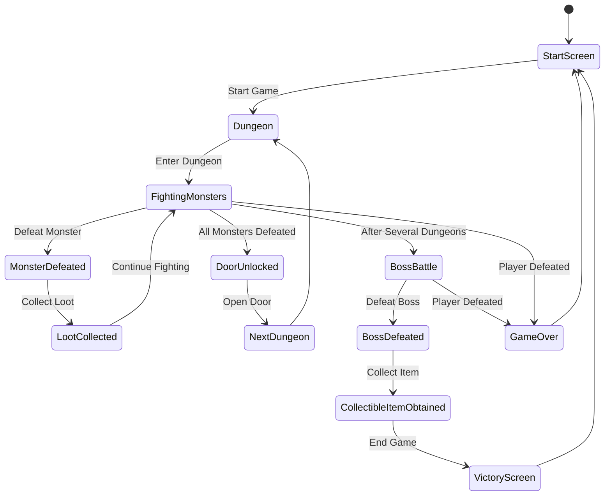
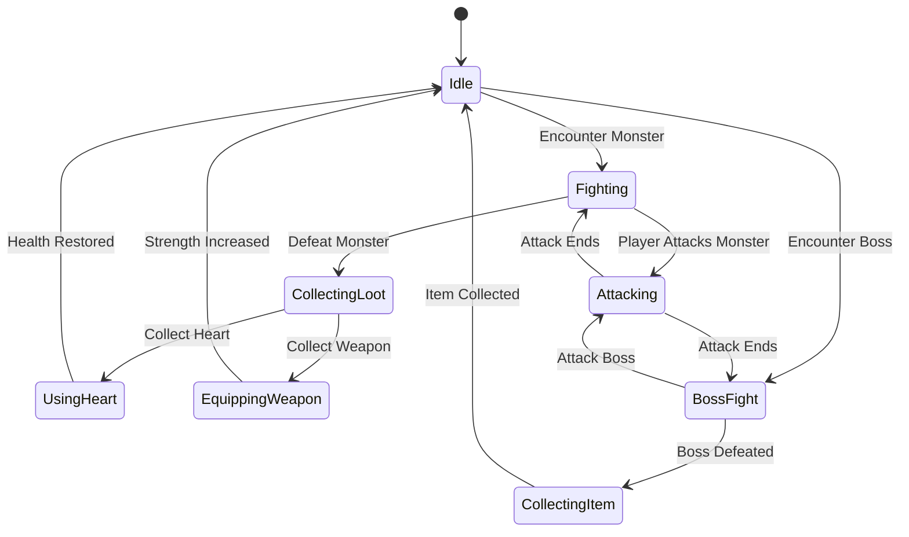
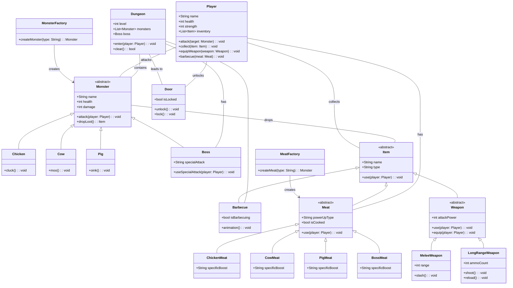
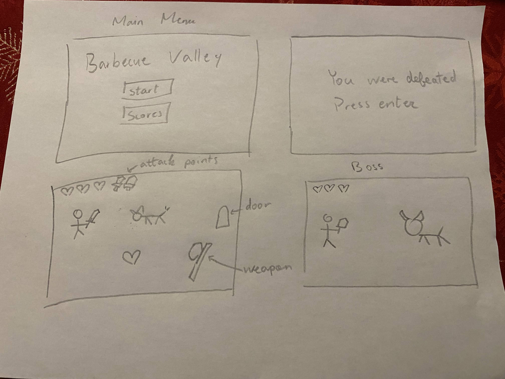

# Final Project

-   [ ] Read the [project requirements](https://vikramsinghmtl.github.io/420-5P6-Game-Programming/project/requirements).
-   [ ] Replace the sample proposal below with the one for your game idea.
-   [ ] Get the proposal greenlit by Vik.
-   [ ] Place any assets in `assets/` and remember to update `src/config.json`.
-   [ ] Decide on a height and width inside `src/globals.js`. The height and width will most likely be determined based on the size of the assets you find.
-   [ ] Start building the individual components of your game, constantly referring to the proposal you wrote to keep yourself on track.
-   [ ] Good luck, you got this!

---

# BBQ Vally
 
## ✒️ Description
In this rogue like game, you play as a hungry farmer looking to eat the rarest meat of them all which was a giant boar. He needs to get pass from a bunch of other animals defending this boar so that he can claim the meat an enjoy himself with the delicous giant boar meat.
## 🕹️ Gameplay
The player has to pass 3 chambers before fighting the boss. For each chamber the player needs to kill all the enemies before they are able to move on to the next chamber. All chambers will have different enemies in them. At the final chamber, you need to fight the boss and if you succeed, then he'll drop some meat that the player will collect.

## 📃 Requirements
1. A controllable player
2. The player is able to move around using the key A, W, S, D
3. The player is able to attack enemies with its weapon
4. The enemies are able to attack the player which causes the player to lose health
5. The player must kill all enemies in the chamber before proceeding with the next chamber
6.  The player must kill the final boss with multiple hits and pickup the meat it drops to win
7.  If player loses all their health, they lose and must start from the beginning
8.  The player will be brought to the main menu screen to see if they are ready toi play
9.  A camera will follow the player around
10.  The player can collect hearts and weapons
### 🤖 State Diagram

## Game

## Player

### 🗺️ Class Diagram

### 🧵 Wireframes

#### 🖼️ Images

We still need to find a sprite sheet

#### 🔊 Sounds

We will find and use some sounds online or youtube
